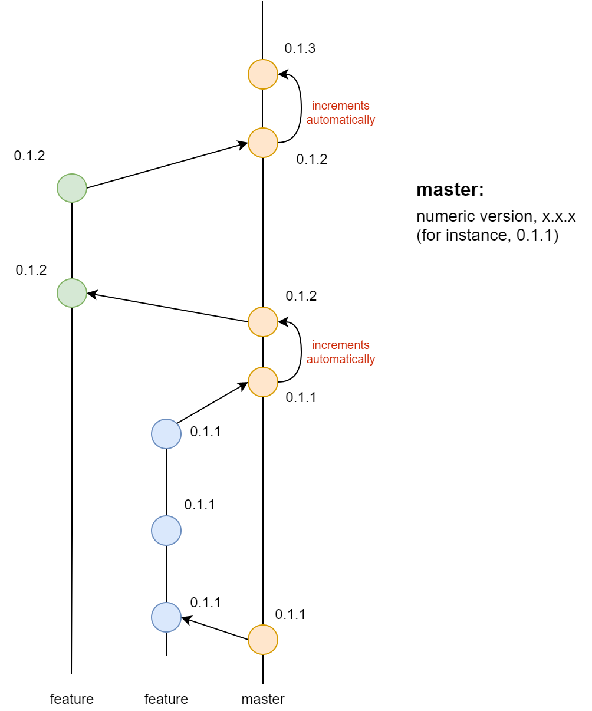
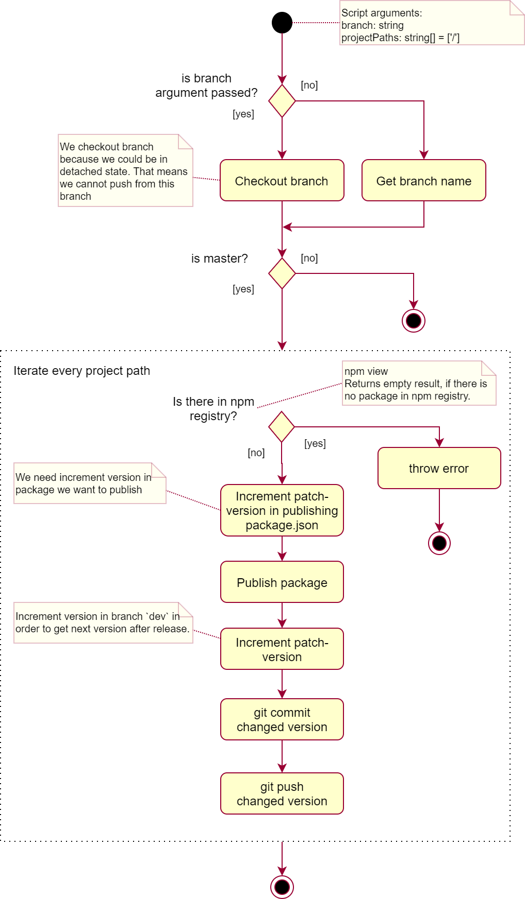

# About

This project contains a script that helps to implement versioning algorithm described below.

# Versioning

## Version number

Now we do not use semantic versioning due to a lot of breaking changes on current stage of the projects. We only:

1. Set major version to 0
2. Set minor version to 1
3. Increment patch versions number.

Our version strategy now: `0.1.x`, where we change only `x`.

## Developing process

Link: [Diagram. Developing process](https://app.diagrams.net/#G1tMea7PiWRWfQW587hHsOB10qE2KlEyMY)

Versioning in live developing process:

1. Work in branch `dev` / `feature` / ...
2. When you want to publish the release version, merge `feature` branch into branch `master`.
After you update `master` branch CI does the following:
    1. Gets numeric version from `package.json`
    2. Publish package to npm repo
    3. Increment version in `package.json`
    4. Commits updated version.  
    **Be sure you set an auto-commit check on CI to prevent an endless loop of commits and CI**
3. Version is incremented automatically if it is already exists (patch version is incremented). 
If version is automatically changed, we have automatically created commit in branch `master`.
If you want, you can set any different version number in `feature` branch before merging to `master`.

## Continuous integration

Link: [Diagram. Publish script](https://app.diagrams.net/?#G1vAuRixKK4VOVRYpTGHgzgLxB2b5SdAfU)

Publishing algorithm looks like:

# Why do we have that dependencies?

* `@eigenspace/argument-parser` - argument parser command line.
* `@eigenspace/logger` - common logger.

# Why do we have that dev dependencies?

* `@eigenspace/codestyle` - includes lint rules, config for typescript.
* `@eigenspace/commit-linter` - linter for commit messages.
* `husky` - used for configure git hooks.
* `@types/*` - contains type definitions for specific library.
* `@eigenspace/common-types` - contains common type definitions.
* `@eigenspace/helper-scripts` - contains common scripts definitions.
* `jest` - testing framework to write unit specs (including snapshots).
* `ts-jest` - it lets you use Jest to test projects written in TypeScript.
* `eslint` - it checks code for readability, maintainability, and functionality errors.
* `eslint-plugin-eigenspace-script` - includes set of script linting rules and configuration for them.
* `typescript` - is a superset of JavaScript that have static type-checking and ECMAScript features.
* `lint-staged` - used for configure linters against staged git files.

# CI

**Important!**

Travis creates the .npmrc file during ci startup. This file contains the access token to the npm repository.
